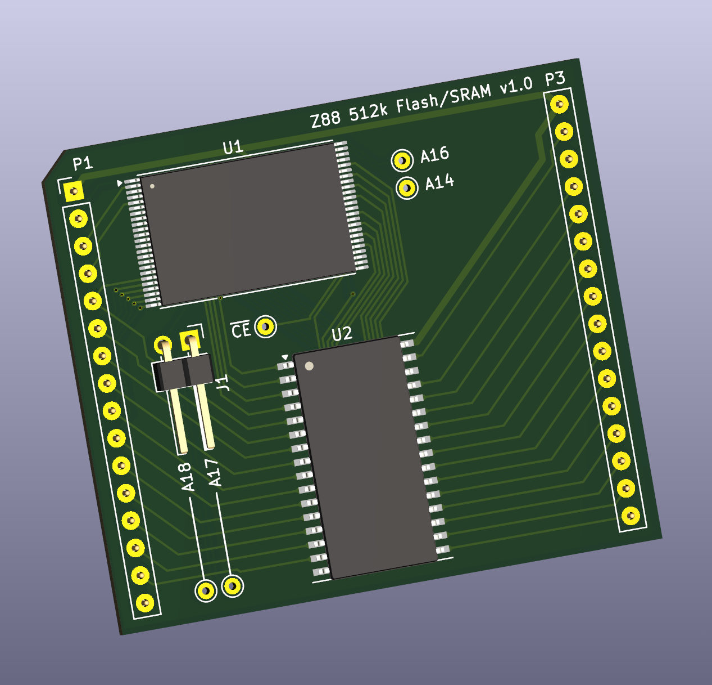
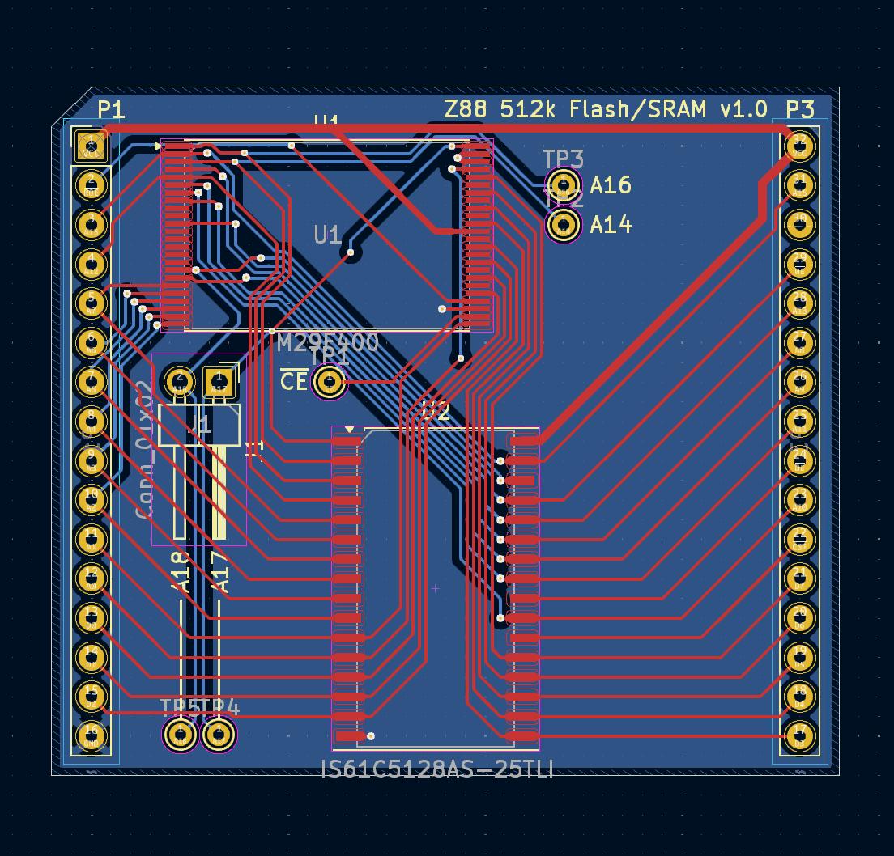

# Z88 Internal Memory Upgrade Board

**This is a very alpha-stage design for a single-board internal RAM/Flash ROM upgrade for the Cambridge Z88 computer.**

&nbsp;

## Background
The Z88 can address up to 4 MB of RAM and ROM in three physical expansion slots and the internal RAM and ROM. Since the internal RAM and ROM are addressed as logical slot 0, they can use the full address space, which is not used by the base 32 kB RAM and 128 kB ROM. Normally to upgrade internal memory like this, one would just desolder the original RAM and ROM, replace them with sockets, and install new flash and bigger RAM, but in the Z88, there is both: 
1) very little room between the board and the keyboard frame, and
2) the existing chip footprint does not have the A17 and A18 address lines required to increase the RAM and ROM to 512kB, from 32kB and 128kB, respectively.

There is an existing mod to upgrade the internal memory that has been floating around since some time in the early 90s, which involves lifting pins on the replacement 512 kB flash and SRAM chips and soldering three or four fly wires to various locations on the board. Very much not a straightforward job, and the best writeup for it available on the internet has at least two of the address lines mislabeled, so the top two address bits are flipped. This doesn't really matter for RAM, since everything is going to be written with those same address lines swapped, but it sure does for the ROM. I chased this around for several hours over a few weeks before I realized the writeup had it wrong. 

Since the A17 and A18 address lines and slot-select lines are all available on vias, I had the idea to create a board that has pins at the corresponding locations that can simply be soldered into place like any other through-hole device. Originally, this was going to have pin headers duplicating the legs of both DIP devices, which was a hassle. About halfway through trying to design a board with all those traces routed around 56 through-hole pins, I realized that since both original memory devices were on the same bus and both have very similar pinouts, many of the necessary signals were duplicated such that only the two outer rows of pins are needed from each original footprint. This saves many pins and holes, both of which cost money, as well as making the traces MUCH easier to route without having to dodge around all the extra pins.
## Current Status
As of March 2026, I have still not had boards made or soldered up any prototypes, so if you build one of these, it is the most YMMV, do-so-at-your-own-risk, safety-third, hold-my-beer project.
## What's Been Done
- Z88 motherboard traces followed and holes measured, to make sure we're pulling the right signals and putting the pins in the right places
- the uhhhh basic design lol
- models made for the Mill-Max DIP-sized pin headers, which are smaller in diameter and shorter overall than Dupont header pins, which will not fit in holes drilled for DIP pins
- bypass caps added, to prove I'm not a scrub-ass n00b *[I am a scrub-ass n00b]*
